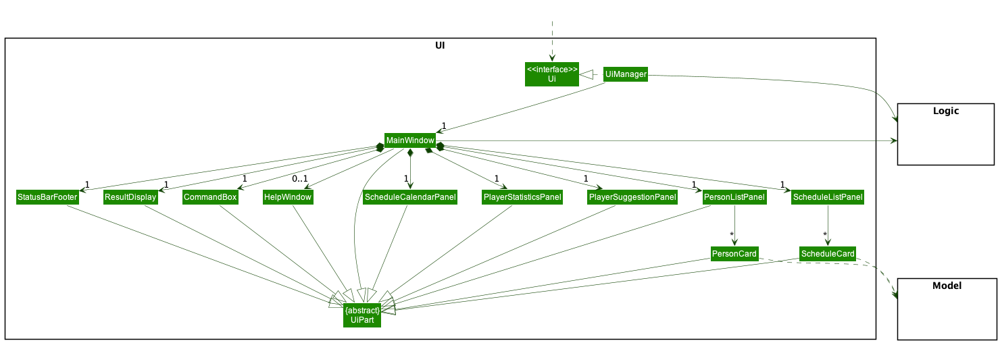
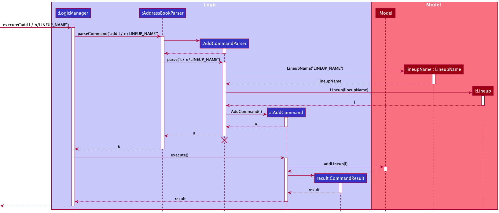
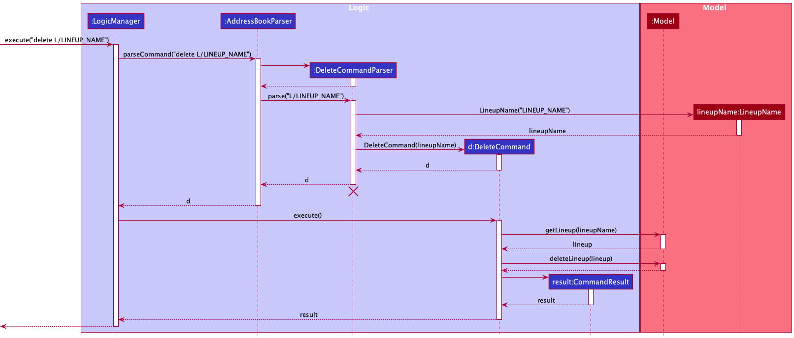
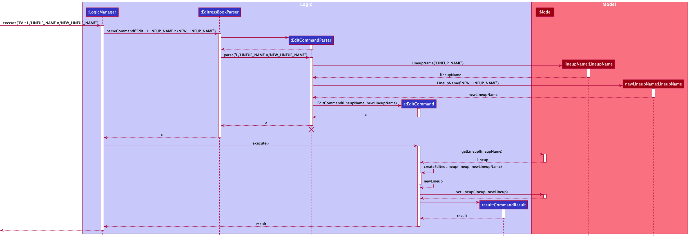
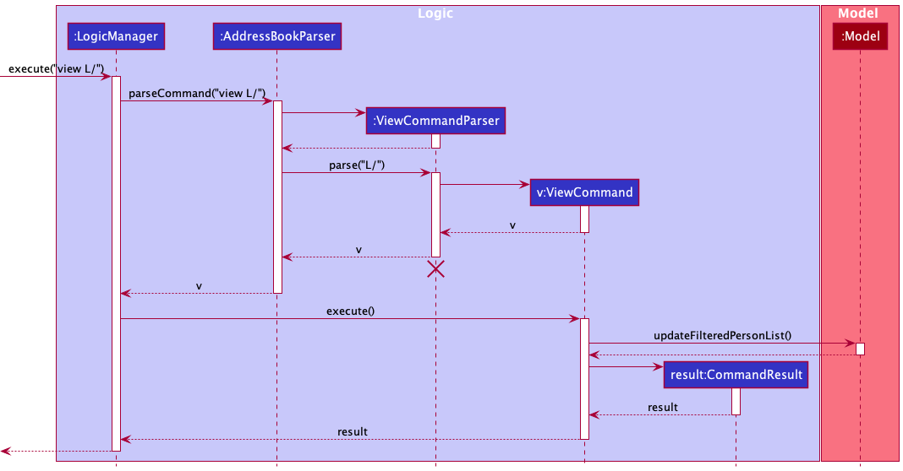
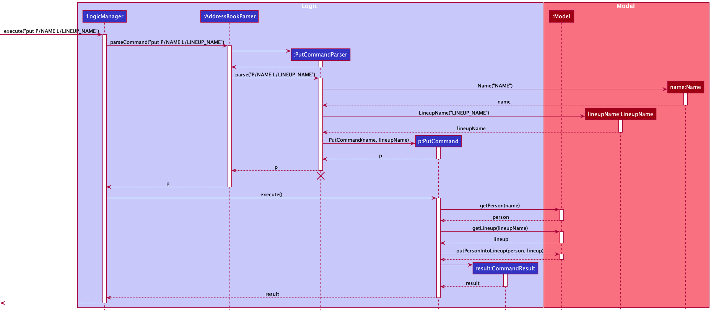

* Table of Contents
{:toc}

--------------------------------------------------------------------------------------------------------------------

## **Acknowledgements**

* {list here sources of all reused/adapted ideas, code, documentation, and third-party libraries -- include links to the original source as well}

--------------------------------------------------------------------------------------------------------------------

## **Setting up, getting started**

Refer to the guide [_Setting up and getting started_](SettingUp.md).

--------------------------------------------------------------------------------------------------------------------

## **Design**

:bulb: **Tip:** The `.puml` files used to create diagrams in this document can be found in the [diagrams](https://github.com/se-edu/addressbook-level3/tree/master/docs/diagrams/) folder. Refer to the [_PlantUML Tutorial_ at se-edu/guides](https://se-education.org/guides/tutorials/plantUml.html) to learn how to create and edit diagrams.

### Architecture

The ***Architecture Diagram*** given above explains the high-level design of the App.

Given below is a quick overview of main components and how they interact with each other.

**Main components of the architecture**

**`Main`** has two classes called [`Main`](https://github.com/AY2122S2-CS2103-F09-1/tp/blob/master/src/main/java/seedu/address/Main.java) and [`MainApp`](https://github.com/AY2122S2-CS2103-F09-1/tp/blob/master/src/main/java/seedu/address/MainApp.java). It is responsible for,
* At app launch: Initializes the components in the correct sequence, and connects them up with each other.
* At shut down: Shuts down the components and invokes cleanup methods where necessary.

[**`Commons`**](#common-classes) represents a collection of classes used by multiple other components.

The rest of the App consists of four components.

* [**`UI`**](#ui-component): The UI of the App.
* [**`Logic`**](#logic-component): The command executor.
* [**`Model`**](#model-component): Holds the data of the App in memory.
* [**`Storage`**](#storage-component): Reads data from, and writes data to, the hard disk.

**How the architecture components interact with each other**

The *Sequence Diagram* below shows how the components interact with each other for the scenario where the user issues the command `delete 1`.

Each of the four main components (also shown in the diagram above),

* defines its *API* in an `interface` with the same name as the Component.
* implements its functionality using a concrete `{Component Name}Manager` class (which follows the corresponding API `interface` mentioned in the previous point.

For example, the `Logic` component defines its API in the `Logic.java` interface and implements its functionality using the `LogicManager.java` class which follows the `Logic` interface. Other components interact with a given component through its interface rather than the concrete class (reason: to prevent outside component's being coupled to the implementation of a component), as illustrated in the (partial) class diagram below.

The sections below give more details of each component.

### UI component

The **API** of this component is specified in [`Ui.java`](https://github.com/AY2122S2-CS2103-F09-1/tp/blob/master/src/main/java/seedu/address/ui/Ui.java)

The UI consists of a `MainWindow` that is made up of parts e.g.`CommandBox`, `ResultDisplay`, `PersonListPanel`, `StatusBarFooter` etc. All these, including the `MainWindow`, inherit from the abstract `UiPart` class which captures the commonalities between classes that represent parts of the visible GUI.

The `UI` component uses the JavaFx UI framework. The layout of these UI parts are defined in matching `.fxml` files that are in the `src/main/resources/view` folder. For example, the layout of the [`MainWindow`](https://github.com/se-edu/addressbook-level3/tree/master/src/main/java/seedu/address/ui/MainWindow.java) is specified in [`MainWindow.fxml`](https://github.com/se-edu/addressbook-level3/tree/master/src/main/resources/view/MainWindow.fxml)

The `UI` component,

* executes user commands using the `Logic` component.
* listens for changes to `Model` data so that the UI can be updated with the modified data.
* keeps a reference to the `Logic` component, because the `UI` relies on the `Logic` to execute commands.
* depends on some classes in the `Model` component, as it displays `Person` object residing in the `Model`.

### Logic component

**API** : [`Logic.java`](https://github.com/AY2122S2-CS2103-F09-1/tp/blob/master/src/main/java/seedu/address/logic/Logic.java)

Here's a (partial) class diagram of the `Logic` component:

How the `Logic` component works:
1. When `Logic` is called upon to execute a command, it uses the `AddressBookParser` class to parse the user command.
1. This results in a `Command` object (more precisely, an object of one of its subclasses e.g., `AddCommand`) which is executed by the `LogicManager`.
1. The command can communicate with the `Model` when it is executed (e.g. to add a person).
1. The result of the command execution is encapsulated as a `CommandResult` object which is returned back from `Logic`.

The Sequence Diagram below illustrates the interactions within the `Logic` component for the `execute("delete 1")` API call.

:information_source: **Note:** The lifeline for `DeleteCommandParser` should end at the destroy marker (X) but due to a limitation of PlantUML, the lifeline reaches the end of diagram.

Here are the other classes in `Logic` (omitted from the class diagram above) that are used for parsing a user command:

How the parsing works:
* When called upon to parse a user command, the `AddressBookParser` class creates an `XYZCommandParser` (`XYZ` is a placeholder for the specific command name e.g., `AddCommandParser`) which uses the other classes shown above to parse the user command and create a `XYZCommand` object (e.g., `AddCommand`) which the `AddressBookParser` returns back as a `Command` object.
* All `XYZCommandParser` classes (e.g., `AddCommandParser`, `DeleteCommandParser`, ...) inherit from the `Parser` interface so that they can be treated similarly where possible e.g, during testing.

### Model component
**API** : [`Model.java`](https://github.com/AY2122S2-CS2103-F09-1/tp/blob/master/src/main/java/seedu/address/model/Model.java)

The `Model` component,

* stores the address book data i.e., all `Person` objects (which are contained in a `UniquePersonList` object).
* stores the currently 'selected' `Person` objects (e.g., results of a search query) as a separate _filtered_ list which is exposed to outsiders as an unmodifiable `ObservableList<Person>` that can be 'observed' e.g. the UI can be bound to this list so that the UI automatically updates when the data in the list change.
* stores a `UserPref` object that represents the user’s preferences. This is exposed to the outside as a `ReadOnlyUserPref` objects.
* does not depend on any of the other three components (as the `Model` represents data entities of the domain, they should make sense on their own without depending on other components)

:information_source: **Note:** An alternative (arguably, a more OOP) model is given below. It has a `Tag` list in the `AddressBook`, which `Person` references. This allows `AddressBook` to only require one `Tag` object per unique tag, instead of each `Person` needing their own `Tag` objects. 

### Storage component

**API** : [`Storage.java`](https://github.com/AY2122S2-CS2103-F09-1/tp/blob/master/src/main/java/seedu/address/storage/Storage.java)

The `Storage` component,
* can save both address book data and user preference data in json format, and read them back into corresponding objects.
* inherits from both `AddressBookStorage` and `UserPrefStorage`, which means it can be treated as either one (if only the functionality of only one is needed).
* depends on some classes in the `Model` component (because the `Storage` component's job is to save/retrieve objects that belong to the `Model`)

### Common classes

Classes used by multiple components are in the `seedu.addressbook.commons` package.

--------------------------------------------------------------------------------------------------------------------

## **Implementation**

This section describes some noteworthy details on how certain features are implemented.

### 1. Add feature

#### 1.1 Add Player
#### Proposed implementation
#### Design Consideration

#### 1.2 Add lineup
#### Proposed implementation
The proposed add lineup functionality will create a new lineup and store it inside `UniqueLineupList`.

The following sequence diagram shows how the undo operation works:

#### Design Consideration
**Aspect: Where to store lineup data:**

* **Alternative 1 (current choice):** Store its name as person's attributes.
  * Pros: Easy to implement. No need to have another json file for storage.
  * Cons: Need to search through all players to create all lineups for each relaunch of the application.

* **Alternative 2:** Store lineups in the same json file as person.
  * Pros: Easy to implement load data.
  * Cons: Troublesome to save all data.

#### 1.3 Add schedule
#### Proposed implementation
#### Design Consideration
**Aspect: Are multiple schedules allowed on the same day:**

* **Alternative 1 (current choice):** Allow multiple schedules on the same date.
  * Pros: Easy to implement. No need to check for duplicate of dates.
  * Cons: NA

* **Alternative 2:** Disallow multiple schedules on the same date.
  * Pros: NA
  * Cons: Some more implementations needed.

### 2. Delete feature

#### 2.1 Delete player
#### Proposed implementation
The proposed delete player functionality will delete an existing player from `UniquePlayerList`,
as well as from all lineups in `UniqueLineupList` that contains the player.

#### Design Consideration

**Aspect: How to delete a person from `UniquePersonList` by its name?**
* **Alternative 1 (current choice):** Iterate through `internalList` to find the person, then delete it.
  * Pros: Easy to implement.
  * Cons: Slower for large quantity of players, but acceptable within our requirement.
* **Alternative 2:** Create a HashMap from `Name` to each person, then access it quickly.
  * Pros: More efficient.
  * Cons: Hard to implement and time-consuming.

#### 2.2 Delete lineup
#### Proposed implementation
The proposed delete lineup functionality will delete an existing lineup from `UniqueLineupList` and remove all players from the lineup.

#### Design Consideration
**Aspect: How to remove lineup from `UniqueLineupList`:**

* **Alternative 1 (current choice):** Remove directly from the internal list.
  * Pros: Easy to implement.
  * Cons: The status of AddressBook is not modified and `updateItem()` of GUI needs to be triggered manually.

* **Alternative 2:** Create another list without the player to be removed.
  * Pros: The `updateItem()` of GUI will be automatically triggered.
  * Cons: Troublesome to implement and time expensive.

#### 2.3 Delete player from lineup
#### Proposed implementation
After checking that both input player and lineup are valid, the lineup's name will be removed from player's `LineupName` list. Then the player will be removed from lineup's `Person` list.

#### Design Consideration
**Aspect: NA**

#### 2.4 Delete schedule
#### Proposed implementation
#### Design Consideration

### 3. Edit feature

#### 3.1 Edit player
#### Proposed implementation
#### Design Consideration

#### 3.2 Edit lineup
#### Proposed implementation
The proposed edit lineup functionality will update the name of a lineup.
Meanwhile, the `lineups` attribute of each person should also be updated if the person is in the lineup.

#### Design Consideration
**Aspect: How to locate lineup in `UniqueLineupList`:**

* **Alternative 1 (current choice):** Iterate through all lineups to locate it.
    * Pros: Easy to implement.
    * Cons: Slower for large quantity of lineups, but sufficient within our requirement.

* **Alternative 2:** Use a HashMap to store the mappings between `LineupName` and `Lineup`.
    * Pros: Time efficient.
    * Cons: Troublesome to implement.

#### 2.3 Edit schedule
#### Proposed implementation
#### Design Consideration

### 4. View feature

#### 4.1 View player
#### Proposed implementation
The proposed view player functionality queries players from the existing UniquePersonList. The players returned is
dependent on the keywords specified in the command. The proposed view mechanism is facilitated by ModelManger which
keeps a FilteredList of players. Note that this FilteredList of players is updated via a specified Predicate.

Additionally, it implements the following operations:
- `ModelManager#updateFilteredPersonList(Predicate<Person>) - Filters internal storage via a Predicate<Person> specification`

Given below is an example usage scenario and how the find mechanism behaves at each step.

Step 1. The user launches the application.

Step 2. The user wants to view player name with james in its name.

Step 3. The user executes `view P/james`. The view command will check if the inputs are valid, and then parsed
(similar to the other CRUD commands) before using these inputs to create conditional `Predicate<>` instances (eg. NameContainsKeywordsPredicate).
The predicates are then combined and used to filter the `FilteredList<Person>`. The GUI will then display the player items in the filtered list.

The following sequence diagram shows how the find operation works:
Sequence Diagram:
__TO BE ADDED__

#### Design Consideration
For future development (v1.3b), may consider to enter more flags so that user can perform more specific view task.

#### 4.2 View lineup

#### Proposed implementation
#### Design Consideration

#### 4.3 View schedule
#### Proposed implementation
The proposed implementation of view schedule has three variants, which differ in Step 2 and 3 of user scenarios.

Step 1. The user launches the application.

Step 2a. The user wants to view active schedules happening at future dates.
Step 3a. The user executes `view S/`.  The command will set the predicate for `FilteredList<Schedule>` to be `PREDICATE_SHOW_ACTIVE_SCHEDULES`.

Step 2b. The user wants to view all historically added schedules.
Step 3b. The user executes `view S/ a/all`.  The command will set the predicate for `FilteredList<Schedule>` to be `PREDICATE_SHOW_ALL_SCHEDULES`.

Step 2c. The user wants to view archived schedules only.
Step 3c. The user executes `view S/ a/archive`.  The command will set the predicate for `FilteredList<Schedule>` to be `PREDICATE_SHOW_ARCHIVED_SCHEDULES`.

step 2d. The user wants to view schedules on a specific date.
Step 3d. The user executes `view S/ d/2000-11-29`. The command will set the predicate for `FilteredList<Schedule>` to be a new `ScheduleOnThisDatePredicate`.

The following sequence diagram shows how the find operation works:
Sequence Diagram:
__TO BE ADDED__

#### Design Consideration
**Aspect: How to set the default display of schedule to active schedules only:**

* **Alternative 1 (current choice):** Set the predicate at initialization of `AddressBook`.
    * Pros: Easy to implement.
    * Cons: Risk breaking abstraction principle because `LogicManager` is implementing for `ModelManager`.

* **Alternative 2:** Set the predicate inside `ModelManager`.
  * Pros: `LogicManager` will not call functions other than `get...()` of `ModelManager`.
  * Cons: Difficult to implement.

### 5. Put feature
Puts a `Person` into a `Lineup`
#### Proposed implementation

Stores the `LineupName` in `Person`

Calls `AdressBook#addPersonToLineup(LineupName, Person)` -- Puts the player into the Lineup

#### Design Consideration
**Aspect: How to navigate from player to lineup:**

* **Alternative 1 (current choice):** Store `LineupName` as an attribute of player.
  * Pros: Easy to Implement. Easy to navigate.
  * Cons: Risk of multiple source of truth. More prone to bugs.

* **Alternative 2:** Iterate through lineups to find the ones a player belongs to.
  * Pros: No multiple source of truth.
  * Cons: Iteration might be time-consuming.

**Aspect: How to keep track the `Lineup` a `Person` belongs to**

**Alternative 1: (Current choice)** Attributes of `Person`

Pros: Efficient and easy to find `Lineup` of `Person`

Cons: Need to update both `Person` and `Lineup`

**Alternative 2: Using `Lineup` Only

Pros: Only need to update `Lineup`

Cons: Need to iterate through all `Lineup` to find out the `Lineup` a `Person` belongs to

### 6. Clear feature

#### Proposed implementation
#### Design Consideration

### Below are to be removed

### \[Proposed\] Undo/redo feature

#### Proposed Implementation

The proposed undo/redo mechanism is facilitated by `VersionedAddressBook`. It extends `AddressBook` with an undo/redo history, stored internally as an `addressBookStateList` and `currentStatePointer`. Additionally, it implements the following operations:

* `VersionedAddressBook#commit()` — Saves the current address book state in its history.
* `VersionedAddressBook#undo()` — Restores the previous address book state from its history.
* `VersionedAddressBook#redo()` — Restores a previously undone address book state from its history.

These operations are exposed in the `Model` interface as `Model#commitAddressBook()`, `Model#undoAddressBook()` and `Model#redoAddressBook()` respectively.

Given below is an example usage scenario and how the undo/redo mechanism behaves at each step.

Step 1. The user launches the application for the first time. The `VersionedAddressBook` will be initialized with the initial address book state, and the `currentStatePointer` pointing to that single address book state.

Step 2. The user executes `delete 5` command to delete the 5th person in the address book. The `delete` command calls `Model#commitAddressBook()`, causing the modified state of the address book after the `delete 5` command executes to be saved in the `addressBookStateList`, and the `currentStatePointer` is shifted to the newly inserted address book state.

Step 3. The user executes `add n/David …​` to add a new person. The `add` command also calls `Model#commitAddressBook()`, causing another modified address book state to be saved into the `addressBookStateList`.

:information_source: **Note:** If a command fails its execution, it will not call `Model#commitAddressBook()`, so the address book state will not be saved into the `addressBookStateList`.

Step 4. The user now decides that adding the person was a mistake, and decides to undo that action by executing the `undo` command. The `undo` command will call `Model#undoAddressBook()`, which will shift the `currentStatePointer` once to the left, pointing it to the previous address book state, and restores the address book to that state.

:information_source: **Note:** If the `currentStatePointer` is at index 0, pointing to the initial AddressBook state, then there are no previous AddressBook states to restore. The `undo` command uses `Model#canUndoAddressBook()` to check if this is the case. If so, it will return an error to the user rather
than attempting to perform the undo.

The following sequence diagram shows how the undo operation works:

:information_source: **Note:** The lifeline for `UndoCommand` should end at the destroy marker (X) but due to a limitation of PlantUML, the lifeline reaches the end of diagram.

The `redo` command does the opposite — it calls `Model#redoAddressBook()`, which shifts the `currentStatePointer` once to the right, pointing to the previously undone state, and restores the address book to that state.

:information_source: **Note:** If the `currentStatePointer` is at index `addressBookStateList.size() - 1`, pointing to the latest address book state, then there are no undone AddressBook states to restore. The `redo` command uses `Model#canRedoAddressBook()` to check if this is the case. If so, it will return an error to the user rather than attempting to perform the redo.

Step 5. The user then decides to execute the command `list`. Commands that do not modify the address book, such as `list`, will usually not call `Model#commitAddressBook()`, `Model#undoAddressBook()` or `Model#redoAddressBook()`. Thus, the `addressBookStateList` remains unchanged.

Step 6. The user executes `clear`, which calls `Model#commitAddressBook()`. Since the `currentStatePointer` is not pointing at the end of the `addressBookStateList`, all address book states after the `currentStatePointer` will be purged. Reason: It no longer makes sense to redo the `add n/David …​` command. This is the behavior that most modern desktop applications follow.

The following activity diagram summarizes what happens when a user executes a new command:

#### Design considerations:

**Aspect: How undo & redo executes:**

* **Alternative 1 (current choice):** Saves the entire address book.
  * Pros: Easy to implement.
  * Cons: May have performance issues in terms of memory usage.

* **Alternative 2:** Individual command knows how to undo/redo by
  itself.
  * Pros: Will use less memory (e.g. for `delete`, just save the person being deleted).
  * Cons: We must ensure that the implementation of each individual command are correct.

_{more aspects and alternatives to be added}_

### \[Proposed\] Data archiving

_{Explain here how the data archiving feature will be implemented}_

--------------------------------------------------------------------------------------------------------------------

## **Documentation, logging, testing, configuration, dev-ops**

* [Documentation guide](Documentation.md)
* [Testing guide](Testing.md)
* [Logging guide](Logging.md)
* [Configuration guide](Configuration.md)
* [DevOps guide](DevOps.md)

--------------------------------------------------------------------------------------------------------------------

## **Appendix: Requirements**

### Product scope

**Target user profile**:

This product is for competitive team sports manager to manage players in their clubs
(i.e. roles, player attributes, trainings), lineup formation during practice as well
as scheduling of events (i.e. trainings, competitions, etc.).

**Value proposition**:

This product solves:
* the issues of managing large quantity of players;
* the issues of managing large quantity of training and competition schedules in a club;
* keeping track of the players that have played in the same lineup before;
* identifying the positions that are lacking of manpower for recruitment.

This product is not able to:
* support users with multiple clubs.
* provide recommendation on coaching strategies, etc.

### User stories

Priorities: High (must have) - `* * *`, Medium (nice to have) - `* *`, Low (unlikely to have) - `*`

| Priority | As a …​        | I want to …​                                                                                   | So that I can…​                                                                                    |
|----------|----------------|------------------------------------------------------------------------------------------------|----------------------------------------------------------------------------------------------------|
| `* * *`  | potential user | look at the sample data provided such as sample players and schedule                           | quickly visualise the functions of this app                                                        |
| `* * *`  | new user       | see usage instructions                                                                         | refer to instructions when I forget how to use the app                                             |
| `* * *`  | user           | add a new player                                                                               | keep track of players' progress and conditions                                                     |
| `* * *`  | user           | add a new training date                                                                        | keep track of training dates                                                                       |
| `* * *`  | user           | tag my players by their position                                                               | know the number of players in that position                                                        |
| `* * *`  | user           | see the list of available jersey number                                                        | no need to remember the jersey numbers that has been taken                                         |
| `* * *`  | user           | see the players that belongs to certain lineup                                                 | quickly assign these players to start a match                                                      |
| `* * *`  | user           | update my players details (eg phone number or position tags)                                   | keep my players information up to date on the app                                                  |
| `* * *`  | expert user    | add my players to a lineup                                                                     | keep track of the lineups that I have played                                                       |
| `* * *`  | expert user    | add the areas of improvement to each player                                                    | curate a training for that player                                                                  |
| `* * *`  | expert user    | delete player details that are no longer part of the team                                      | keep track a list of valid players that I need                                                     |
| `* * *`  | expert user    | quickly jot down notes about my player                                                         | remember my thoughts of a certain player                                                           |
| `* * *`  | user           | save all existing data to my hard disk                                                         | avoid losing all my data                                                                           |
| `* * *`  | user           | retrieve all saved data from my hard disk                                                      | retrieve all my data                                                                               |
| `* *`    | potential user | purge the mock data                                                                            | adopt it for my own use                                                                            |
| `* *`    | expert user    | quickly add multiple/recurring training dates at once by import                                | add all the forecasted training dates at once                                                      |
| `* *`    | expert user    | quickly add information of all my players at once by import                                    | add all the players I have at once                                                                 |
| `* *`    | user           | tag the strength and weakness of each of my player (e.g. green for strength, red for weakness) | know the strength and weakness of each player is more explicitly represented                       |
| `* *`    | user           | filter my players according to their position                                                  | quickly see the players that plays that position                                                   |
| `* *`    | user           | upload the score after a competition                                                           | keep track of the result of previous matches                                                       |
| `* *`    | expert user    | view aggregated data of the team (e.g number of players for each position)                     | have a summary of overview of my team                                                              |
| `* *`    | expert user    | add shortcuts (for listing lineups etc) to my application                                      | save a lot of time by accessing to the commonly used commands                                      |
| `* *`    | expert user    | search for my players quickly                                                                  | avoid scrolling through the whole list to look for a player                                        |
| `* *`    | long-term user | archive the players' data for those who have quited the tea                                    | clear about which players are still part of the my club                                            |
| `* *`    | expert user    | mark the attendance of daily training                                                          | avoid using pen and paper and can directly view each player's attendace rate over a period of time |
| `*`      | user           | tag my players by 'fit to play'                                                                | know which are the available healthy players for competition                                       |
| `*`      | new user       | key in the first few letters to see what commands starting with these letters are available    | know the potential commands that starts with these letters                                         |
| `*`      | expert user    | send mass reminders to each players one day before the training date                           | automate the sending of announcements to my players                                                |
| `*`      | user           | change the theme to light mode                                                                 | read the words more clearly in various environment                                                 |

*{More to be added}*

### Use cases

(For all use cases below, the **System** is the `MyGM` and the **Actor** is the `user`, unless specified otherwise)

**Use case: UC01 - Find A Player**

**MSS**

1. User requests to find a player.
2. MyGM displays details about the player.
Use case ends.

**Extensions**

* 1a. MyGM detects an error in the entered command.
  * 1a1. MyGM displays the error message.
  Use case ends.

* 1b. MyGM cannot find the player.
  * 1b1. MyGM displays failure.
  Use case ends.

**Use case: UC02 - Create a new Lineup**

**MSS**

1. User adds a new lineup.
2. MyGM displays the success message.
3. User put a player into the lineup
4. MyGM displays the success message.
   Repeat 3 until the lineup is full.
   Use case ends.

**Extensions**

* 1a. The lineup already exist in MyGM
  * 1a1. MyGM displays the error message.
  Use case returns to the start of 3.

* 3a. MyGM cannot find the player.
  * 3a1. MyGM displays the error message.
  Use case returns to the start of 3.

* 3b. The lineup is already full.
  * 3b1. MyGM displays the error message.
  Use case ends.

**Use case: UC03 - Tagging a Player’s Position**

**MSS**

1. Find a player (UC01)
2. User adds a tag to the player.
3. MyGM displays the success message.
   Use case ends.

**Extensions**
* 3a. User entered an invalid tag.
  * 3a1. MyGM displays the invalid tag message and the appropriate tags.
  Use case ends.

**Use case: UC04 - Editing a Player’s Details**

**MSS**

1. Find a player (UC01)
2. User input the new details of the player.
3. MyGM displays the success message.
   Use case ends.

**Extensions**
* 1a. User entered a player that does not exist.
    * 1a1. MyGM displays the invalid player message.
      Use case ends.
* 3a. User entered an invalid input for any of the fields.
    * 3a1. MyGM displays the invalid input message and the appropriate command.
      Use case ends.

*{More to be added}*

### Non-Functional Requirements

1. Should work on any _mainstream OS_ as long as it has Java `11` or above installed.
2. Should be able to hold up to `100` players without a noticeable sluggishness in performance for typical usage.
3. A user with above average typing speed for regular English text (i.e. not code, not system admin commands) should be able to accomplish most of the tasks faster using commands than using the mouse.
4. Should have a _friendly user interface_.
5. The system should respond within `2` seconds.
6. Should there be any invalid command, the part of the command that causes this issue should be **highlighted**.

### Glossary

* **Club**: A basketball club consisting of a number of players, who regularly trains and participates in competitions.
* **Lineup**: Players from part of a club that play together on the court, typically consisting of 5 players.
* **Schedule**: Event of a team, including training and competitions.
* **Mainstream OS**: Windows, Linux, Unix, OS-X
--------------------------------------------------------------------------------------------------------------------

## **Appendix: Instructions for manual testing**

Given below are instructions to test the app manually.

:information_source: **Note:** These instructions only provide a starting point for testers to work on;
testers are expected to do more *exploratory* testing.

### Launch and shutdown

1. Initial launch

   1. Download the jar file and copy into an empty folder

   1. Double-click the jar file Expected: Shows the GUI with a set of sample contacts. The window size may not be optimum.

1. Saving window preferences

   1. Resize the window to an optimum size. Move the window to a different location. Close the window.

   1. Re-launch the app by double-clicking the jar file. 
       Expected: The most recent window size and location is retained.

1. _{ more test cases …​ }_

### Adding a person

1. Adding a new player into the team

    1. Test case: `add P/ n/John Doe p/98765432 e/johnd@example.com h/180 j/23 w/80 t/PG t/SG` 
       Expected: Player named "John" is added. Details of the added player shown in the status message. Timestamp in the status bar is updated.

    1. Test case: `add P/John Doe p/98765432 e/johnd@example.com h/180 j/23 w/80 t/PG t/SG` 
       Expected: No person is deleted. Error details shown in the status message. Status bar remains the same.

    1. Other incorrect delete commands to try: `add P/`, `add P/ n/John Doe`, `...` (where any of the required prefix is missing) 
       Expected: Similar to previous.

### Deleting a person

1. Deleting a person while all persons are being shown

   1. Prerequisites: List all persons using the `view` command. Multiple persons in the list.

   1. Test case: `delete P/John` 
      Expected: Player named "John" is deleted.

   1. Test case: `delete P/Baabababa` 
      Expected: No person is deleted. Error details shown in the status message. Status bar remains the same.

   1. Other incorrect delete commands to try: `delete`, `delete John`, `...` (where the prefix is missing) 
      Expected: Similar to previous.

1. _{ more test cases …​ }_

### Saving data

1. Dealing with missing/corrupted data files

   1. _{explain how to simulate a missing/corrupted file, and the expected behavior}_

1. _{ more test cases …​ }_
